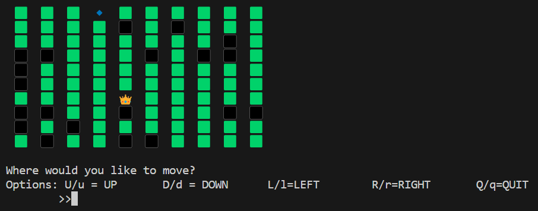

# Find-Your-Crown
This project contains a simple terminal app to exercise Node.js, it was promoted by Codecademy.

## How to use
To have access to this project you could follow these steps:
1. Clone the Repository locally.
2. On a terminal of your choice, navigate to the projects folder. 
3. Run <code>npm install</code>.
4. Finally run <code>node main.js</code>

Have a good one! 👋